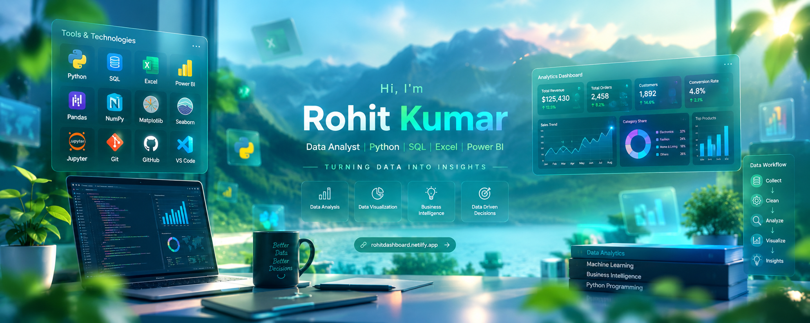

GITHUB PROFILE README
=====================

IMPORTANT FOLDER STRUCTURE

your-repository/
├── README.md
├── assets/
│   └── bg.png
└── .github/
    └── workflows/
        └── snake.yml


README.md
=========

<div align="center">



<br>

<a href="https://rohitdashboard.netlify.app/">
  
</a>
<a href="https://www.linkedin.com/in/rohit-kumar-52b50024b/">
  
</a>
<a href="mailto:rohitmobiledev7159@gmail.com">
  
</a>
<a href="https://www.hackerrank.com/profile/rohitmobiledev71">
  
</a>

<br><br>


</div>

---

<div align="center">


<p>
<b>Data Analyst focused on turning raw data into clear insights, KPIs and interactive dashboards.</b>
</p>

</div>

---

## About Me

I’m a **Data Analyst** with a technical background in **React Native, JavaScript and application development**.

My current focus is business analytics — understanding data, finding patterns, building KPIs and creating dashboards that communicate insights clearly.

```text
RAW DATA
   ↓
CLEAN & TRANSFORM
   ↓
SQL / PYTHON / EXCEL
   ↓
EDA + KPI ANALYSIS
   ↓
POWER BI DASHBOARD
   ↓
BUSINESS INSIGHTS
```

### What I Work With

| Area | Tools |
|---|---|
| Data Analysis | Python, Pandas, NumPy |
| Visualization | Matplotlib, Seaborn, Power BI |
| Database | SQL, MySQL |
| Excel Analytics | Power Query, Pivot Tables, XLOOKUP |
| BI | Power BI, DAX |
| Development | React Native, JavaScript, TypeScript, Node.js |
| Tools | Git, GitHub, VS Code |

---

# Tech Stack

<div align="center">

### Data & Analytics


<br><br>


### Development Background


</div>

---

# Featured Project

## E-Commerce Business Analytics

**Python • SQL • Excel • Power BI**

An end-to-end analytics project designed around real business questions rather than only technical exercises.

| Business Area | What I Analyze |
|---|---|
| Sales | Revenue, orders, AOV and growth |
| Customers | Customer behavior and segmentation |
| Products | Category, brand and product performance |
| Payments | Payment methods and payment status |
| Delivery | Shipping and delivery performance |
| Returns | Return rate and return reasons |
| Marketing | Spend, clicks and conversions |

### Dashboard KPIs

<div align="center">


<br><br>

<a href="https://rohitdashboard.netlify.app/">

</a>

</div>

---

# GitHub Analytics

<div align="center">

<a href="https://github.com/rohit-kumar-fullstack">

</a>

<a href="https://github.com/rohit-kumar-fullstack">

</a>

<br><br>


</div>

---

# Contribution Activity

<div align="center">


</div>

---

# Contribution Snake

<div align="center">


</div>

> The snake animation is generated automatically from the GitHub contribution graph.

---

# Analytics Mindset

<div align="center">

<table>
<tr>
<td align="center" width="25%">

### 01
**COLLECT**

Raw Data

</td>
<td align="center" width="25%">

### 02
**CLEAN**

Quality Data

</td>
<td align="center" width="25%">

### 03
**ANALYZE**

Patterns & KPIs

</td>
<td align="center" width="25%">

### 04
**INSIGHT**

Business Action

</td>
</tr>
</table>

</div>

---

# Currently Learning

<div align="center">


</div>

---

# What I Bring

```text
Data Analysis        ████████████████████
SQL                  ██████████████████░░
Excel                ██████████████████░░
Power BI             ████████████████░░░░
Python               ████████████████░░░░
Dashboard Design     ███████████████░░░░░
Business Thinking    ███████████████░░░░░
```

---

# Connect With Me

<div align="center">

<a href="https://rohitdashboard.netlify.app/">

</a>

<a href="https://www.linkedin.com/in/rohit-kumar-52b50024b/">

</a>

<a href="https://www.hackerrank.com/profile/rohitmobiledev71">

</a>

<a href="mailto:rohitmobiledev7159@gmail.com">

</a>

</div>

<br>

<div align="center">


</div>

---

<div align="center">


</div>


